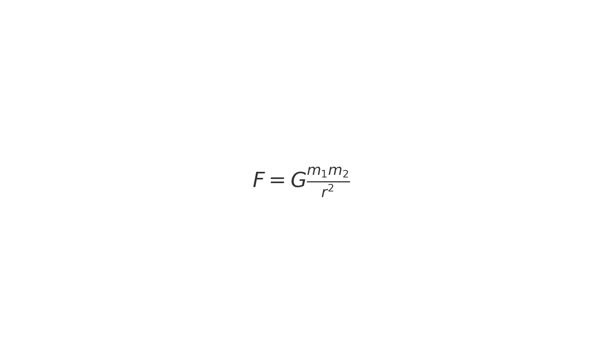
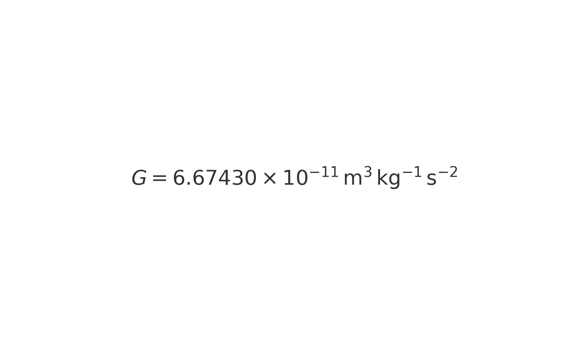

# Gravity Simulator

A simple gravity simulator built with Python and Pygame, where particles appear with a mouse click and interact with each other based on gravitational forces.

## Features

- Add particles by clicking on the screen
- Particles interact with each other using gravitational forces
- Real-time particle movement and interaction visualization

## Science Behind the Simulation

The behavior of the particles in this simulation is governed by the principles of Newtonian gravity. According to Newton's law of universal gravitation, every particle in the universe attracts every other particle with a force that is directly proportional to the product of their masses and inversely proportional to the square of the distance between their centers. The formula for this gravitational force \( F \) is: <br>




Where: <br>


- \( m_1 \) and \( m_2 \) are the masses of the two particles
- \( r \) is the distance between the centers of the two particles

In the simulation, the particles' positions and velocities are updated at each time step based on the gravitational forces exerted by all other particles. The force calculation involves determining the vector components of the force in the x and y directions, which are then used to update the particles' velocities and positions.

This creates a dynamic system where particles move according to the gravitational influences they exert on each other, resulting in complex and interesting behaviors that mimic the gravitational interactions seen in real-world physics.


## Installation

1. **Clone the repository:**
    ```bash
    git clone https://github.com/yourusername/gravity_sim.git
    cd gravity_sim
    ```

2. **Create a virtual environment (optional but recommended):**
    ```bash
    python -m venv venv
    source venv/bin/activate  # On Windows, use `venv\Scripts\activate`
    ```

3. **Install the required dependencies:**
    ```bash
    pip install pygame
    ```

## Usage

1. **Run the simulation:**
    ```bash
    python gravity_sim.py
    ```

2. **Interact with the simulation:**
    - Click anywhere on the screen to add a particle at the mouse position.